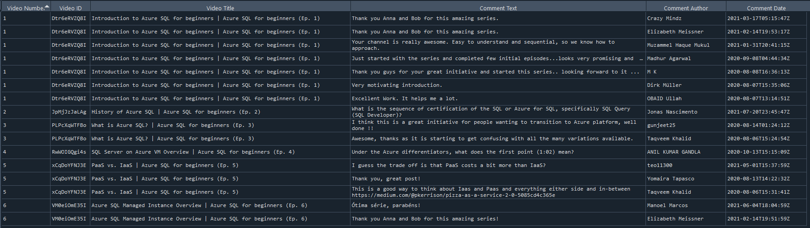

#  Comments of a Playlist using Youtube Data API.

## Scrape script to extract comments of a youtube playlist.

the script using the request module to call the Youtube Data Api and extract the comments of all videos included in a playlist and dump it in JSON file.

### How it Works:

-   Clone the repo.
-   Open the python script.
-   Enter you API Key from GCP in the variable `api_key` in line 9.
-   Enter the playlist ID in the variable `playlist_id` in line 12.
-   Open your **Terminal** and go to the repo directroy.
-   Write `python .`.
-   Check the **Output.json** file.

#### Notes **Collaboration Opportunities**:

- Replies on the comments are not provided.
- Maximum number of comments are *100* comment pagination is not provided in comments.

***

**Feel free to copy, snip, clone, and/or fork the project**
### Thanks,
### BM